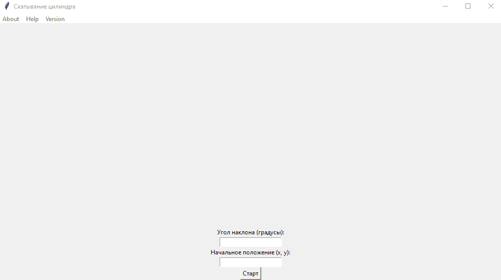

# Cylinder Rolling App

 

[](https://github.com/valeriveledara/cylinder-rolling/releases)
[](https://github.com/valeriveledara/cylinder-rolling/actions/workflows/app.yml)
[](https://t.me/bloody_marr)
---
Приложение показывает скатывание цилиндра по поверхности с заданным наклоном и координатами.

Это простое приложение на Python, использующее библиотеку Tkinter 
для создания графического интерфейса. 

Приложение разработано по следующему заданию:
> Требуется составить программу, которая демонстрировала бы скатывания цилиндра по наклонной плоскости. Заданы угол наклона
плоскости и начальное положение цилиндра. Демонстрация до момента достижения горизонтальной плоскости.

## Демонстрация приложения

---


## **Запуск и установка**

---

```cmd
git clone git@github.com:valeriveledara/cylinder-rolling.git

install python

```


## **Как использовать**

---
Открыть терминал в исходной папке проекта и выполнить следующую команду:
```cmd
python main.py
```

После запуска, вы увидите окно приложения. Введите значения (см. ниже) и нажмите кнопку Старт:

1) Угол наклона поверхности в градусах
2) Координаты x и y начальной позиции цилиндра

## **Лицензия**

---

Этот проект лицензирован в соответствии с условиями лицензии [MIT](LICENSE.md).


## **Автор**

---
  - GitHub: [valeriveledara](https://github.com/valeriveledara)